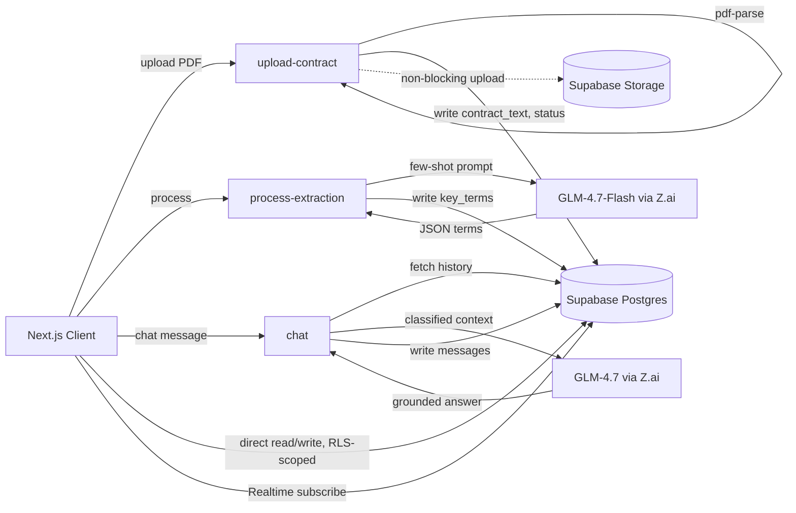
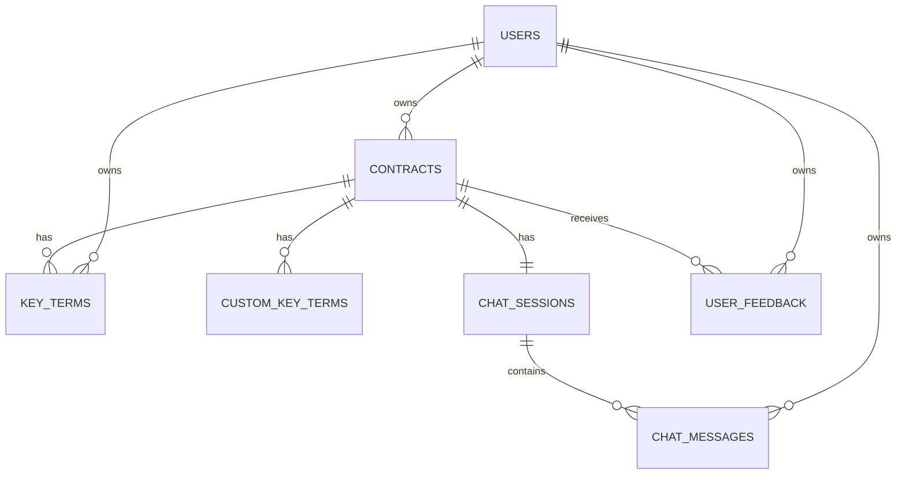

# ContractIQ — Engineering Document

**Status:** Draft for review (Stage 1 of build workflow)
**Source:** `docs/ContractIQ_PRD.md` (v1.0, June 24 2026)
**Owner:** Engineering
**Contract types in scope:** NDA, MSA (English-language, US/UK law, text-layer PDFs)

This document is the authoritative technical reference for ContractIQ. No implementation begins until this document and the derived `docs/specs/` (Stage 2) are approved.

---

## 1. Executive Summary

**Project:** ContractIQ — an AI-assisted contract review tool that extracts key terms from NDAs and MSAs, attributes each term to a page and source sentence, scores extraction confidence, and lets users ask follow-up questions about the contract in plain English.

**Business goal:** Give SMB founders, ops leads, and freelancers a $19–$129/month alternative to $250–$500/hr lawyer-reviewed contracts, cutting review time from 90–120 minutes to ≤15 minutes per contract.

**Problem statement:** Business professionals without in-house legal counsel sign NDAs and MSAs without understanding what they're agreeing to. Rule-based parsers miss >30% of clause variants across law firms and geographies; generic AI chat tools produce unstructured summaries with no page reference, confidence score, or correction loop. ContractIQ combines structured LLM extraction with page-level attribution, confidence scoring, and a document-grounded chat interface.

**Target users:**
- **Primary:** Time-pressed founder / ops lead / procurement manager (5–250 employee company, no legal counsel, signs 5–15 NDAs/MSAs per month)
- **Secondary:** Freelancer / consultant (signs 1–4 client MSAs per month, no leverage to negotiate, no budget for legal review)

**Success criteria (from PRD §3):**

| Metric | Target |
|---|---|
| North Star: upload → completed review | ≤ 15 minutes end-to-end |
| Key-term extraction F1 | ≥ 88% (NDA), ≥ 85% (MSA) |
| Confidence calibration error | ≤ 0.10 per 10%-bucket |
| Time to first extracted key-term | ≤ 30s P95 (≤20-page contracts) |
| Chat response latency | ≤ 15s P95 |
| Cost per contract analysis | ≤ $0.25 (target $0.20 for extraction) |
| Chat hallucination rate | ≤ 5% |
| 30-day retention | ≥ 45% |

---

## 2. Product Scope

### In Scope (MVP, PRD v0.1–v1.0)

- Email/password auth (Supabase Auth), session persistence
- PDF upload: NDA or MSA, ≤ 10 MB, ≤ 20 pages, ≤ 15,000 tokens, text-layer only
- Server-side text extraction once at upload, stored with `[PAGE N]` markers
- Pre-processing preview of standard terms to be extracted, by contract type
- Custom key term addition (up to 5 per analysis)
- GLM-4.7-Flash key-term extraction: term name, value, page number, confidence score (0–100%), source sentence
- Key terms panel with colour-coded confidence (green ≥80%, amber 50–79%, red <50%) and low-confidence warning (never hidden)
- Results page: PDF.js viewer (primary) with click-to-navigate, or paginated text-viewer fallback if Storage is unavailable
- Inline term correction, with original AI value preserved for the feedback loop
- Contract chat: full-context Q&A grounded strictly in the uploaded document, mandatory `[Page X]` citation, persistent chat history (≤200 messages)
- Dashboard: contract history, sortable by date/name/type, summary counts by contract type
- Feedback: thumbs up/down + optional comment (P2, ships in v1.0)
- "Not legal advice" disclaimer on every results page
- Security hardening, RLS, WCAG 2.1 AA review, rate limiting (v1.0 launch gate)

### Out of Scope (MVP)

- Scanned/image PDFs (OCR) — graceful rejection: "Scanned PDFs are not supported yet" (triggered when extracted text < 100 words)
- Non-English contracts or non-US/UK governing law
- Contract types other than NDA/MSA
- CSV/PDF export (P2 — deferred to v1.1, see Future Enhancements)
- Multi-user / team workspaces
- Contract comparison, batch upload, email notifications

### Future Enhancements (post-MVP, from PRD roadmap)

- **v1.1:** Export key terms to CSV; export results summary to PDF; batch upload (≤5 contracts); dashboard analytics (contracts-by-month chart, correction-rate chart)
- **v1.2:** Scanned PDF support via OCR (AWS Textract or equivalent); side-by-side contract comparison view; email notifications on processing completion; multi-user workspace (team plans)

---

## 3. User Personas

ContractIQ has a **single user role** for MVP — there is no admin, reviewer, or team-workspace role. Every row in every table is owned by exactly one `user_id`, enforced by RLS (see §7, §13).

| Persona | Company/context | Behaviour | Primary workflow |
|---|---|---|---|
| **Founder / Ops Lead** (primary) | SaaS, agency, professional services, fintech, e-commerce; 5–250 employees; no in-house legal | Signs 5–15 NDAs/MSAs per month; currently relies on Google searches or ad-hoc paid legal consults | Upload → review key terms → verify low-confidence items → chat for clarifying questions → move on |
| **Freelancer / Consultant** (secondary) | Design, marketing, software, consulting; individual contributor | Receives 1–4 client MSAs per month; signs without full review due to power imbalance with larger clients | Upload → scan key terms for risk (liability cap, IP assignment, termination) → chat "is this clause standard?" |

**Permissions model:** Both personas get identical permissions — full CRUD on their own contracts, key terms, chat sessions, and feedback; zero visibility into any other user's data. No elevated role exists in the MVP schema.

---

## 4. User Flows

Format: `User Action → Frontend Behavior → Backend Processing → Database Interaction → System Response`

### Flow 1 — Sign Up → Dashboard

1. **Action:** User clicks "Get Started Free" on the landing page.
   **Frontend:** Opens Supabase Auth sign-up modal (email + password fields, client-side validation).
   **Backend:** Supabase Auth handles registration, issues verification email.
   **DB:** Supabase Auth writes to `auth.users`; a Postgres trigger provisions no additional row (no `profiles` table needed at MVP — `auth.users.id` is the `user_id` FK used everywhere).
   **Response:** User redirected to `/dashboard`, which renders the empty state: "No contracts reviewed yet — upload your first contract to begin."

### Flow 2 — Sign In → Dashboard

1. **Action:** Returning user submits email/password on `/sign-in`.
   **Frontend:** Calls `supabase.auth.signInWithPassword`; on success, TanStack Query invalidates the `contracts` query key to fetch fresh data.
   **Backend:** Supabase Auth verifies credentials, returns a JWT session.
   **DB:** `SELECT` against `contracts` filtered by `user_id = auth.uid()` (RLS-enforced).
   **Response:** Dashboard renders summary card (total contracts, breakdown by type NDA/MSA, last 5 contracts) with a prominent "Review a Contract" CTA.

### Flow 3 — Core Flow: Contract Review

```
Click "Review Contract" → Choose Contract Type → Upload PDF
→ PDF Text Extraction → Key Term Preview → Add Custom Terms (optional)
→ Click "Process Contract" → GLM Extraction → Results Page
→ Contract Preview + Key Term Panel + Chat
```

1. **Action:** User selects contract type (NDA/MSA) and drops a PDF (≤10 MB, ≤20 pages).
   **Frontend:** Client-side validates file size/type before upload; shows upload progress bar.
   **Backend:** `upload-contract` Edge Function receives the file, runs `pdf-parse`, inserts `[PAGE N]` markers into the extracted text, validates word count (reject if <100 words → "Scanned PDFs are not supported yet") and token count (reject if >15,000 tokens).
   **DB:** Insert into `contracts` (`contract_text`, `contract_type`, `status = 'text_extracted'`); async, non-blocking upload of the raw PDF to Supabase Storage (`file_path` set on success, left `null` on Storage failure — AI pipeline is unaffected).
   **Response:** Frontend shows the pre-processing preview card listing the standard terms for the selected contract type (10 for NDA, 12 for MSA) pulled from a static term-schema config, not from the API.

2. **Action:** User optionally clicks "+ Add Key Term" (up to 5 times) and clicks "Process Contract."
   **Frontend:** Custom terms appended to preview list with a "Custom" badge; 3-step progress indicator begins (extracting → analysing → compiling).
   **Backend:** `process-extraction` Edge Function builds the few-shot extraction prompt (contract type + standard term schema + custom terms + full `contract_text`), calls GLM-4.7-Flash with `response_format: json_object`, temperature 0.1., On JSON parse failure, sends one retry prompt ("return only the JSON array"); on second failure, sets `status = 'error'`.
   **DB:** Insert one row per extracted term into `key_terms` (standard) / `custom_key_terms` (custom, `is_manual = true`); update `contracts.status = 'processed'`.
   **Response:** Redirect to `/contracts/[id]` results page.

3. **Action:** User views results.
   **Frontend:** Two-panel layout — left: PDF.js viewer (or text-viewer fallback if `file_path IS NULL`) driven by a shared `targetPage` prop; right: key terms list (name, value, page, confidence, colour-coded).
   **Backend:** None (data already in DB from step 2); signed URL for the PDF requested from Supabase Storage (1-hour expiry) only if `file_path` is set.
   **DB:** `SELECT` from `key_terms` + `custom_key_terms` joined by `contract_id`.
   **Response:** Terms with confidence < 50% render with a ⚠️ icon and non-dismissible tooltip; clicking a page number smooth-scrolls the viewer and highlights the nearest matching span; clicking "Why?" expands the verbatim `source_sentence`.

4. **Action:** User edits an incorrect term inline.
   **Frontend:** Inline edit field, optimistic update via TanStack Query mutation.
   **Backend:** `PATCH /api/key-terms/:id` (or Edge Function equivalent) validates the new value.
   **DB:** `UPDATE key_terms SET value = ?, is_edited = true, original_ai_value = <previous value>`.
   **Response:** Term row displays an "Edited" badge; original AI value retained for the correction-rate feedback loop.

### Flow 4 — Chat with Contract

```
Results Page → Click "Chat" Tab → Type Question → GLM-4.7 Response (grounded in contract text)
→ Conversation logged to Supabase
```

1. **Action:** User opens the chat tab and types a question ("Is there an auto-renewal clause?").
   **Frontend:** Message appended optimistically to the chat thread (right-aligned); loading indicator shown.
   **Backend:** `chat` Edge Function fetches the full `chat_messages` history for the session (≤200, ascending) *before* the new message is saved, classifies the question (`contract` / `history` / `both`), retrieves only the matching context (contract text + last 10 turns, or last 20 turns of history only), and calls GLM-4.7-Flash with a system prompt matched to that type, temperature 0.4.
   **DB:** Insert user message and assistant response into `chat_messages` (role, content, `context_source`, timestamp), linked to `chat_sessions` → `contracts`.
   **Response:** Assistant response renders left-aligned with a source badge and, for `contract`/`both` answers, a mandatory `[Page X]` citation (or "I cannot find this in the document" if the answer is absent).

### Derived Flow — Feedback Submission (P2, v1.0)

**Action:** User clicks thumbs up/down on the results page, optionally adds a comment → **Frontend:** inline rating widget → **Backend:** `feedback` Edge Function validates payload → **DB:** insert into `user_feedback` (`user_id`, `contract_id`, `rating`, `comment`, `timestamp`) → **Response:** toast confirmation, widget becomes read-only for that session.

### Derived Flow — Dashboard Sort/Filter

**Action:** User clicks a column header (date/name/type) → **Frontend:** TanStack Query re-fetches with updated `order_by` param, no full page reload → **Backend:** none (direct Supabase client query) → **DB:** indexed `SELECT ... ORDER BY` on `contracts` → **Response:** list re-renders client-side with sort indicator.

---

## 5. Frontend Architecture

**Stack:** Next.js 14 (App Router), TypeScript, Tailwind CSS.

**State management:**
- **Server state:** TanStack Query for all data that originates from Supabase tables or Edge Functions — contracts list, key terms, chat messages, dashboard aggregates. Query keys are scoped per resource (`['contracts', userId]`, `['key-terms', contractId]`, `['chat-messages', sessionId]`) with mutation-based cache invalidation (no manual refetch loops).
- **Auth/session:** Supabase JS client (`@supabase/ssr`) manages the session cookie; a `SupabaseProvider` context exposes the current user to client components.
- **Realtime:** Supabase Realtime channel per `chat_sessions.id`, subscribed via `useEffect` in the chat panel, feeding new rows directly into the TanStack Query cache (`queryClient.setQueryData`).
- **UI-only local state:** Plain `useState`/`useReducer` for upload-wizard step, PDF viewer zoom/current page, custom-term input drafts, edit-mode toggles. No global client-state library (Redux/Zustand) is introduced — nothing in the app requires cross-tree UI state beyond what server state + local component state cover.

**Route structure (App Router):**

```
/                         marketing landing page (static)
/sign-in                  auth
/sign-up                  auth
/dashboard                contract history + summary
/upload                   contract type selector + upload + pre-processing preview
/contracts/[id]           results page (PDF/text viewer + key terms panel + chat tab)
```

**UX states (per PRD constraints):**

| State | Behaviour |
|---|---|
| Loading — upload | 3-step progress indicator (extracting text → analysing with AI → compiling results) |
| Loading — dashboard | Skeleton rows for contract list |
| Empty — dashboard | "No contracts reviewed yet — upload your first contract to begin" |
| Error — upload rejected | Clear message for oversize file, page-count overage, or scanned-PDF detection |
| Error — GLM timeout/failure | "Try again in a few minutes" CTA; contract `status = 'error'`, retry does not require re-upload |
| Warning — low confidence | ⚠️ icon + non-dismissible tooltip on any term < 50% confidence |
| Responsive | Two-panel results layout collapses to tabbed single-column below 768px |
| Accessibility | WCAG 2.1 AA: keyboard-navigable PDF viewer controls, ARIA labels on confidence badges, colour is never the sole signal (icon + text accompany every colour-coded state) |

**Page/component hierarchy (results page):**

```
ContractResultsPage
├── ContractHeader (name, type, disclaimer banner)
├── ResultsLayout (two-panel, responsive)
│   ├── DocumentPanel
│   │   ├── PdfViewer (used when contracts.file_path is set)
│   │   └── TextViewer (fallback — parses [PAGE N] markers from contract_text)
│   │   Both respond to a shared `targetPage: number` prop from key-term click events
│   └── KeyTermsPanel
│       ├── KeyTermRow (× N) → ConfidenceBadge, PageLink, WhyExpandable, InlineEditField
│       └── AddCustomTermButton (pre-processing stage only, disabled post-processing)
└── ChatTab
    ├── ChatMessageList (virtualized, subscribes to Realtime channel)
    └── ChatInput
```

---

## 6. Backend Architecture

**Stack:** Supabase Edge Functions (Deno runtime) as a thin orchestration layer — no business logic lives outside these functions and the DB constraints/RLS policies. The GLM API key is stored as an Edge Function secret and never reaches the client.

**Core Edge Functions:**

| Function | Responsibility |
|---|---|
| `upload-contract` | Accepts PDF binary, validates size/page count, runs `pdf-parse`, inserts `[PAGE N]` markers, validates word/token count, writes `contracts` row, kicks off non-blocking Storage upload |
| `process-extraction` | Builds few-shot extraction prompt, calls GLM-4.7-Flash (temp 0.1, JSON mode), retries once on parse failure, writes `key_terms`/`custom_key_terms`, updates `contracts.status` |
| `chat` | Fetches message history, runs query-classification, calls GLM-4.7-Flash (temp 0.4), writes both user + assistant messages to `chat_messages` |
| `update-key-term` | Validates and applies inline corrections, preserves `original_ai_value` |
| `submit-feedback` | Validates and writes to `user_feedback` |

**Error handling:**
- Every GLM call wraps a 3-attempt retry with exponential backoff (per PRD external-dependency mitigation).
- On exhaustion, `contracts.status` is set to `'error'` and a human-readable message is returned — no silent failures.
- Storage upload failures are caught and logged but never block the AI pipeline (`file_path` stays `null`; text-viewer fallback takes over per FR-06).
- Input validation (file size, page count, token count, custom-term count ≤5) happens at the Edge Function boundary before any GLM call is made, to avoid wasted spend on invalid input.

**Service interaction diagram:**



---

## 7. Database Design and Schema

Single Supabase Postgres project. Every table carries a `user_id uuid references auth.users(id)` and RLS restricting all operations to `auth.uid() = user_id` (directly, or transitively via a parent FK for child tables). Full SQL (extensions, triggers, RLS policies, Storage bucket policies) is generated in Stage 2 (`docs/specs/supabase-schema.sql`); this section defines the design.

### `contracts`

| Column | Type | Notes |
|---|---|---|
| `id` | `uuid` PK, default `gen_random_uuid()` | |
| `user_id` | `uuid` FK → `auth.users(id)` | not null, indexed |
| `contract_type` | `text` | `'nda'` \| `'msa'`, check constraint |
| `file_name` | `text` | original upload name |
| `file_path` | `text`, nullable | Storage path `contracts/{user_id}/{contract_id}/{filename}.pdf`; null if Storage upload failed |
| `contract_text` | `text` | full extracted text with `[PAGE N]` markers; single source of truth for extraction + chat |
| `status` | `text` | `'text_extracted'` \| `'processing'` \| `'processed'` \| `'error'` |
| `page_count` | `int` | |
| `created_at`, `updated_at` | `timestamptz` | `updated_at` auto-updated via trigger |

Indexes: `(user_id)`, `(user_id, created_at desc)` for dashboard sort.

### `key_terms`

| Column | Type | Notes |
|---|---|---|
| `id` | `uuid` PK | |
| `contract_id` | `uuid` FK → `contracts(id)` on delete cascade | indexed |
| `user_id` | `uuid` FK → `auth.users(id)` | denormalized for direct RLS check |
| `term_name` | `text` | e.g. "Governing Law" |
| `value` | `text` | current (possibly edited) value |
| `original_ai_value` | `text`, nullable | set only when `is_edited = true` |
| `page_number` | `int` | 1-indexed |
| `confidence_score` | `numeric(5,2)` | 0–100 |
| `source_sentence` | `text` | verbatim sentence the value was drawn from |
| `is_edited` | `boolean` default `false` | |
| `created_at`, `updated_at` | `timestamptz` | |

### `custom_key_terms`

Same shape as `key_terms` plus `is_manual boolean default true` and `term_input text` (the user's original free-text term request). Kept as a separate table so standard-term schema changes never collide with user-defined terms; both are queried together and merged client-side for display.

### `chat_sessions`

| Column | Type | Notes |
|---|---|---|
| `id` | `uuid` PK | |
| `contract_id` | `uuid` FK → `contracts(id)` on delete cascade, unique | one session per contract at MVP |
| `user_id` | `uuid` FK → `auth.users(id)` | |
| `created_at` | `timestamptz` | |

### `chat_messages`

| Column | Type | Notes |
|---|---|---|
| `id` | `uuid` PK | |
| `session_id` | `uuid` FK → `chat_sessions(id)` on delete cascade | indexed, `(session_id, created_at asc)` for ordered fetch |
| `user_id` | `uuid` FK → `auth.users(id)` | |
| `role` | `text` | `'user'` \| `'assistant'`, check constraint |
| `content` | `text` | |
| `page_citation` | `int`, nullable | parsed from `[Page X]` in assistant responses |
| `created_at` | `timestamptz` | |

Cap enforced at the application layer: only the most recent 200 messages per session are passed to the model (PRD §7), but all messages are retained in the table.

### `user_feedback`

| Column | Type | Notes |
|---|---|---|
| `id` | `uuid` PK | |
| `contract_id` | `uuid` FK → `contracts(id)` on delete cascade | |
| `user_id` | `uuid` FK → `auth.users(id)` | |
| `rating` | `text` | `'up'` \| `'down'` |
| `comment` | `text`, nullable | |
| `created_at` | `timestamptz` | |

### Storage

Bucket `contracts`, path pattern `contracts/{user_id}/{contract_id}/{filename}.pdf`. RLS on `storage.objects` restricts INSERT/SELECT/DELETE to `auth.uid()::text = (storage.foldername(name))[1]`. Bucket and policies must be created via SQL (`INSERT INTO storage.buckets`, `CREATE POLICY`), not the dashboard — omitting this silently breaks PDF upload while the text-viewer fallback keeps working (PRD Assumption 13).

### Entity relationship diagram



---

## 8. AI Architecture

**Provider/model:** GLM-4.7-Flash via Z.ai (`https://api.z.ai/api/paas/v4/chat/completions`, `thinking: { type: "disabled" }` to skip reasoning-token overhead) for both `process-extraction` (JSON mode, `response_format: { type: "json_object" }`) and `chat` — swapped in from the original OpenAI GPT-4o plan for cost reasons; the extraction/classification/retrieval/attribution logic is provider-agnostic.

**Prompt paths:**

| Path | Technique | Temp | Max output tokens | Output |
|---|---|---|---|---|
| Key term extraction | Few-shot: 3 labelled NDA examples + 3 MSA examples in system prompt; standard term schema + up to 5 custom terms injected as extraction targets | 0.1 | 2,000 | JSON array: `[{ term_name, value, page_number, confidence_score, source_sentence }]` |
| Contract chat | Full-context RAG-style: entire `contract_text` + up to 200-message ascending history; system prompt: "Answer only from the document text provided. If the answer is not in the document, say so." | 0.4 | 1,000 | Free text, mandatory `[Page X]` citation |

**Context/memory:** Full document is passed on every turn (no chunking/vector retrieval at MVP — contracts are capped at ≤15,000 tokens, so this is tractable and eliminates retrieval-miss risk). Full conversation history (≤200 messages) is passed every turn, enabling memory-style questions. A lightweight query-classification step (`contract` / `history` / `both`) adjusts system-prompt framing without a second model call — implemented as a cheap heuristic/regex pass, not a separate LLM invocation, to avoid extra latency and cost.

**Token limits:** Contract length hard-capped at 15,000 tokens at upload time (rejected with a clear message above that). Extraction output capped at 2,000 tokens; chat output capped at 1,000 tokens.

**Rate limiting:** Per-user rate limit on `process-extraction` and `chat` Edge Functions (e.g. token-bucket keyed on `user_id`) to protect the $0.25/analysis cost ceiling and the 100-concurrent-analysis scalability target; enforced at the Edge Function layer before the GLM call.

**Cost controls:** Target ≤ $0.20 per 20-page extraction (~15,000 input + 1,500 output tokens) monitored against the $0.25 ceiling at GLM pricing. Monthly usage monitored against budget with an alert at 80% threshold. Claude 3.5 / Gemini 1.5 Pro evaluated as fallback providers if GLM pricing or availability changes (PRD external dependency risk).

**Fallback / error recovery:** If JSON parsing fails, one automatic retry is issued ("Your previous response was not valid JSON. Return only the JSON array, no explanation."). A second failure surfaces a user-facing error and sets `contracts.status = 'error'`.

**Hallucination guardrails (PRD §9):**
- Confidence score (0–100%) self-reported per term, in the same inference pass (no second call)
- Terms < 50% confidence: ⚠️ warning + tooltip, never hidden
- `source_sentence` required per term; a term with no supporting sentence is treated as unreliable
- Deterministic extraction settings (temp 0.1 + JSON mode)
- Monthly calibration check: predicted confidence vs. observed accuracy, UI warning if miscalibration ≥ 15%
- Chat: document-only system prompt, mandatory page citation, "I cannot find this in the document" as a valid and expected response
- Automated regression test: feed a question about a topic absent from the document, assert the "cannot find" response

---

## 9. API Specification

All endpoints are Supabase Edge Functions invoked via HTTPS from the Next.js client, authenticated via the Supabase session JWT (`Authorization: Bearer <token>`), scoped by RLS at the DB layer as a second line of defense.

### `POST /functions/v1/upload-contract`
- **Auth:** required
- **Request:** `multipart/form-data` — `file` (PDF binary), `contract_type` (`'nda'|'msa'`)
- **Response 200:** `{ contract_id, status, page_count }`
- **Validation:** file ≤ 10 MB, ≤ 20 pages, extracted text ≥ 100 words, ≤ 15,000 tokens
- **Errors:** `400` invalid contract_type; `413` file too large; `422` page/word/token limit exceeded (message names which limit); `500` extraction failure

### `POST /functions/v1/process-extraction`
- **Auth:** required (must own `contract_id`)
- **Request:** `{ contract_id, custom_terms?: string[] }` (`custom_terms.length ≤ 5`)
- **Response 200:** `{ contract_id, status: 'processed', term_count }`
- **Validation:** `contract_id` must belong to caller and have `status = 'text_extracted'`; `custom_terms.length ≤ 5`
- **Errors:** `401` unauthorized; `404` contract not found; `422` too many custom terms; `502` GLM failure after retries → `contracts.status = 'error'`

### `GET /rest/v1/contracts` (direct Supabase client query, RLS-scoped)
- **Auth:** required
- **Query params:** `order`, `contract_type` filter
- **Response 200:** array of `contracts` rows for `auth.uid()`

### `GET /rest/v1/contracts?id=eq.:id&select=*,key_terms(*),custom_key_terms(*)`
- **Auth:** required
- **Response 200:** single contract with nested key terms

### `PATCH /functions/v1/key-terms/:id`
- **Auth:** required (must own parent contract)
- **Request:** `{ value: string }`
- **Response 200:** `{ id, value, is_edited: true, original_ai_value }`
- **Validation:** `value` non-empty
- **Errors:** `401`, `404`, `422` empty value

### `POST /functions/v1/chat`
- **Auth:** required
- **Request:** `{ contract_id, message: string }`
- **Response 200:** `{ message_id, role: 'assistant', content, page_citation }`
- **Validation:** `message` non-empty, ≤ 2,000 chars
- **Errors:** `401`; `404` no session for contract; `504` GLM timeout (≥20s) → human-readable "try again" message, no partial write

### `GET /rest/v1/chat_messages?session_id=eq.:sessionId&order=created_at.asc`
- **Auth:** required
- **Response 200:** ordered message array (client also subscribes via Realtime for live updates)

### `POST /functions/v1/feedback`
- **Auth:** required
- **Request:** `{ contract_id, rating: 'up'|'down', comment?: string }`
- **Response 200:** `{ id }`
- **Errors:** `401`, `404`, `422` invalid rating value

---

## 10. Feature Breakdown

### Phase 1 — MVP (PRD v0.1–v1.0)

| Feature | Acceptance criteria | Dependencies |
|---|---|---|
| Auth (sign up/in/out) | Auth flow ≤10s; redirect to dashboard; clear error on invalid credentials | Supabase Auth project |
| PDF upload + text extraction | Accepts ≤10MB/≤20pp; ≤30s P95 extraction; scanned PDFs rejected gracefully | `contracts` table, Storage bucket |
| Key-term extraction | ≥80% of standard terms populated with values; confidence + page shown per term | GLM API key, few-shot prompt library |
| Confidence display | Every term shows 0–100% score; <50% shows warning, never hidden | Extraction pipeline |
| Custom key terms | Up to 5 terms accepted pre-processing; same output structure as standard terms | Extraction pipeline |
| Page attribution | Page number per term; click scrolls viewer to page | PDF viewer / text-viewer fallback |
| PDF viewer + text-viewer fallback | Both respond to `targetPage`; fallback activates automatically when `file_path` is null | Storage (optional), `contract_text` |
| Inline term correction | Edit saves ≤2s; "Edited" badge; original value retained | `key_terms` table |
| Contract chat | Response ≤15s P95; grounded in document; mandatory page citation; persistent history | `chat_sessions`/`chat_messages`, Realtime |
| Dashboard + history | Shows totals, type breakdown, sortable list; row click opens results | `contracts` table |
| Feedback (P2, ships in v1.0) | Thumbs up/down + comment saved to `user_feedback` | Results page |
| Security/perf hardening (v1.0 gate) | RLS verified, signed URL expiry enforced, rate limiting live, WCAG 2.1 AA pass, ≤30s P95 | All above |

### Phase 2 — v1.1 (Post-Launch Iteration)

| Feature | Acceptance criteria | Dependencies |
|---|---|---|
| CSV export | Generates within 5s, downloads in browser | Key terms data model (Phase 1) |
| PDF summary export | Formatted report generated within 5s | Key terms + contract metadata (Phase 1) |
| Batch upload (≤5 contracts) | Each contract processed independently, dashboard reflects batch status | Upload pipeline (Phase 1), rate limiting |
| Dashboard analytics | Charts: contracts-by-month, correction rate | Historical `contracts`/`key_terms` data (Phase 1) |

### Phase 3 — v1.2 (Growth)

| Feature | Acceptance criteria | Dependencies |
|---|---|---|
| OCR for scanned PDFs | Falls back to AWS Textract (or equivalent) when text-layer extraction yields <100 words | Upload pipeline (Phase 1) — extends rather than replaces the "scanned PDF" rejection path |
| Contract comparison view | Side-by-side key terms across 2 contracts | Key terms data model (Phase 1) |
| Email notifications | Sent on processing completion | Auth/user email (Phase 1), background job infra |
| Multi-user workspace | Team plan with shared contract visibility | Requires a new `role`/`workspace_id` model — first departure from the single-user-role design in §3/§7 |

---

## 11. Folder Structure

```
contractiq/
├── app/
│   ├── (marketing)/
│   │   └── page.tsx                  # landing page
│   ├── (auth)/
│   │   ├── sign-in/page.tsx
│   │   └── sign-up/page.tsx
│   ├── dashboard/
│   │   └── page.tsx
│   ├── upload/
│   │   └── page.tsx
│   ├── contracts/
│   │   └── [id]/
│   │       ├── page.tsx              # results page shell
│   │       └── loading.tsx
│   └── layout.tsx
├── components/
│   ├── results/
│   │   ├── PdfViewer.tsx
│   │   ├── TextViewer.tsx
│   │   ├── KeyTermsPanel.tsx
│   │   ├── KeyTermRow.tsx
│   │   ├── ConfidenceBadge.tsx
│   │   └── ChatTab.tsx
│   ├── upload/
│   │   ├── ContractTypeSelect.tsx
│   │   ├── FileDropzone.tsx
│   │   └── KeyTermPreviewCard.tsx
│   ├── dashboard/
│   │   ├── ContractHistoryTable.tsx
│   │   └── SummaryCard.tsx
│   └── ui/                           # shared primitives styled per docs/design.md
├── lib/
│   ├── supabase/
│   │   ├── client.ts                 # browser client
│   │   └── server.ts                 # server component / route handler client
│   ├── queries/
│   │   ├── use-contracts.ts          # TanStack Query hooks
│   │   ├── use-key-terms.ts
│   │   └── use-chat-messages.ts
│   ├── openai/
│   │   ├── prompts/
│   │   │   ├── extraction-nda.ts
│   │   │   ├── extraction-msa.ts
│   │   │   └── chat.ts
│   │   └── client.ts
│   └── pdf/
│       └── parse-markers.ts          # shared [PAGE N] marker parsing (extraction + text-viewer)
├── supabase/
│   ├── functions/
│   │   ├── upload-contract/
│   │   ├── process-extraction/
│   │   ├── chat/
│   │   ├── update-key-term/
│   │   └── submit-feedback/
│   └── migrations/                   # generated in Stage 2
├── types/
│   ├── contract.ts
│   ├── key-term.ts
│   └── chat.ts
├── tests/
│   ├── unit/
│   ├── integration/
│   └── e2e/
└── docs/
    ├── engineering/
    ├── specs/
    ├── design.md
    └── security/
```

---

## 12. Naming Conventions

| Category | Convention | Example |
|---|---|---|
| Files/folders (components) | kebab-case folder, PascalCase file | `components/results/KeyTermRow.tsx` |
| React components | PascalCase | `ConfidenceBadge`, `PdfViewer` |
| Hooks | camelCase, `use` prefix | `useContracts`, `useKeyTerms`, `useChatMessages` |
| Edge Functions | kebab-case, verb-first | `upload-contract`, `process-extraction` |
| DB tables | snake_case, plural | `contracts`, `key_terms`, `chat_messages` |
| DB columns | snake_case | `contract_id`, `confidence_score`, `is_edited` |
| API JSON fields | camelCase in request/response bodies at the HTTP boundary; snake_case inside the DB layer | `{ contractId, customTerms }` over the wire, `contract_id` in Postgres |
| Env vars | SCREAMING_SNAKE_CASE, service-prefixed | `OPENAI_API_KEY`, `SUPABASE_SERVICE_ROLE_KEY` |
| Config files | kebab-case | `next.config.js`, `tailwind.config.ts` |
| Test files | mirror source path, `.test.ts(x)` suffix | `tests/unit/parse-markers.test.ts` |

---

## 13. Testing Strategy

| Layer | Framework | Coverage focus |
|---|---|---|
| Unit | Vitest + React Testing Library | `[PAGE N]` marker parsing, confidence colour-coding thresholds (green/amber/red boundaries), custom-term-count validation (≤5), token/page/size limit checks |
| Integration | Vitest against a local Supabase instance (Supabase CLI) | RLS isolation (cross-user access attempts must fail), Edge Function request/response contracts, upload size/page rejection paths, retry-on-invalid-JSON logic |
| E2E | Playwright | Sign-up → upload → extraction → results → chat critical path (PRD Launch Criteria: "core upload-extract-display flow works end-to-end without crashes"); low-confidence warning rendering; inline edit persistence; dashboard sort |

**AI-specific evaluation (distinct from code tests, owned by the eval plan in PRD §10, not part of the CI test suite):** F1 regression suite against the 30 NDA + 20 MSA labelled test set; monthly confidence-calibration check; chat groundedness review (50 Q&A pairs, target ≤5% hallucinated); automated "cannot find this" regression test for out-of-document questions. These run against the offline eval spreadsheet, not the application test runner, but the automated hallucination regression test should be wired into CI as an integration test against a fixed fixture contract.

**Coverage targets:** ≥80% line coverage on `lib/pdf/`, `lib/openai/prompts/`, and all Edge Functions (the highest-risk, highest-complexity code); no fixed threshold on UI components beyond critical-path E2E coverage.

---

## 14. Specs to Implementation Mapping

| Engineering doc section | Stage 2 spec (docs/specs/) | Implementation files |
|---|---|---|
| Auth (§4 Flow 1–2, §3) | `auth-spec.md` | `app/(auth)/sign-in/page.tsx`, `app/(auth)/sign-up/page.tsx`, `lib/supabase/client.ts` |
| PDF upload & extraction (§4 Flow 3.1, §6, §9) | `upload-extraction-spec.md` | `supabase/functions/upload-contract/`, `lib/pdf/parse-markers.ts`, `components/upload/FileDropzone.tsx` |
| Key term extraction (§4 Flow 3.2, §8, §9) | `key-term-extraction-spec.md` | `supabase/functions/process-extraction/`, `lib/openai/prompts/extraction-nda.ts`, `lib/openai/prompts/extraction-msa.ts` |
| Results display & PDF/text viewer (§4 Flow 3.3, §5) | `results-viewer-spec.md` | `components/results/PdfViewer.tsx`, `components/results/TextViewer.tsx`, `components/results/KeyTermsPanel.tsx` |
| Inline correction (§4 Flow 3.4) | `key-term-editing-spec.md` | `supabase/functions/update-key-term/`, `components/results/KeyTermRow.tsx` |
| Contract chat (§4 Flow 4, §8, §9) | `chat-spec.md` | `supabase/functions/chat/`, `lib/openai/prompts/chat.ts`, `components/results/ChatTab.tsx`, `lib/queries/use-chat-messages.ts` |
| Dashboard & history (§4 derived flow) | `dashboard-spec.md` | `app/dashboard/page.tsx`, `components/dashboard/ContractHistoryTable.tsx` |
| Feedback (§4 derived flow) | `feedback-spec.md` | `supabase/functions/submit-feedback/` |
| Database schema (§7) | `supabase-schema.sql` | `supabase/migrations/` |
| Environment/config | `.env.example` | project root |

---

*End of engineering document. Proceed to Stage 2 (`/implementation-specs`) only after this document is reviewed and approved.*
